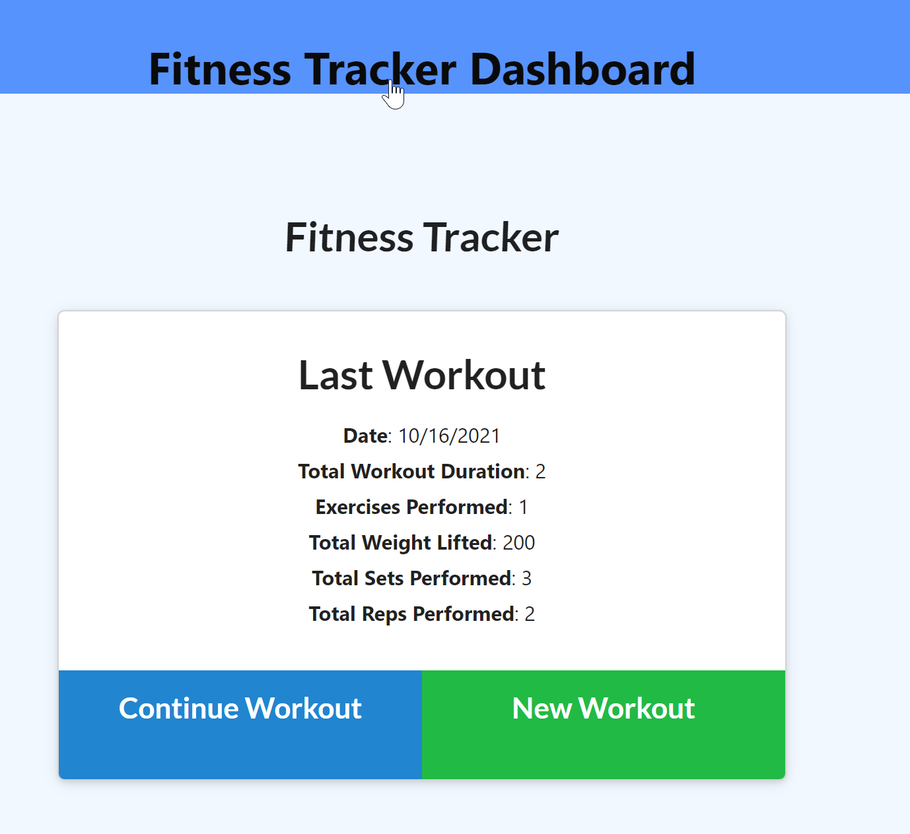
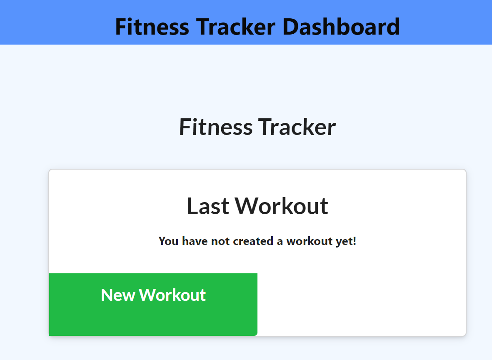
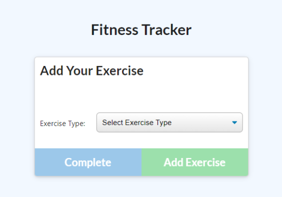
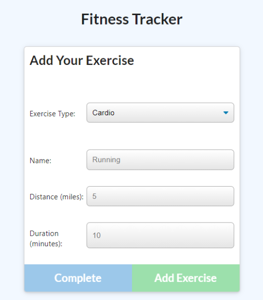

Workout Tracker

## Task
For this assignment, we're asked to create a Mongo database with a Mongoose schema and handle routes with Express for a **workout/fitness tracker** from already provided front end code in the `Develop` folder.


# SOLUTION: 
Submission: 🗂️ [Github Repository](https://github.com/DionneNoellaBarretto/18-FitnessTracker_Mongo-NoSQL-_Mongoose_Express_FullStack) |  📄[Heroku Page](https://calm-cove-09758.herokuapp.com/)

<!-- https://devcenter.heroku.com/articles/deploying-nodejs - Deploying in Heroku -->
--------------------------------

### ResponseUI Solution - Desktop, Tablet & Mobile Views
Starting Screen:  <br>
First Time Login Screen:  <br>
Drop Down Options:  <br>
Resistance Wizard Screen:  <br>
Cardio Wizard Screen:  <br>
Workout Dashboard Screen:  <br>

## Grading Requirements

You are required to submit the following:
```
✅ The URL to the deployed application
✅ The URL to the GitHub repository
```
